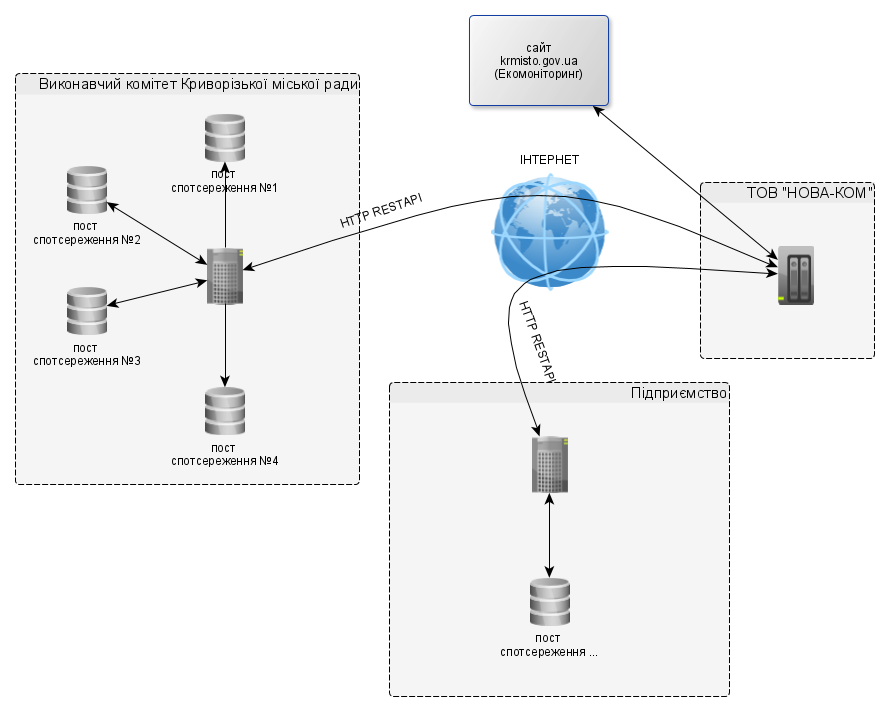

Модуль "Екомоніторинг" Криворізького ресурсного центру передбачає можливість в автоматичному режимі висвітлювати інформацію екологічних показників, що були зібрані із постів спостереження на території міста.

Система моніторингу – це відкрита інформаційна система, пріоритетами функціонування якої є захист життєво важливих екологічних інтересів людини і суспільства; збереження природних екосистем; відвернення кризових змін екологічного стану довкілля і запобігання надзвичайним екологічним ситуаціям (Постанова Кабінету Міністрів України від 30 березня 1998 №391 "Про затвердження Положення про державну систему моніторингу довкілля").

Статтею 33 Закону України "Про місцеве самоврядування в Україні" делеговано повноваження органам місцевого самоврядування щодо створення та забезпечення функціонування місцевих екологічних автоматизованих інформаційно-аналітичних систем, які є складовою мережі загальнодержавної екологічної автоматизованої інформаційно-аналітичної системи забезпечення доступу до екологічної інформації.

Основною метою автоматизованої системи моніторингу є безперервні виміри концентрацій забруднюючих речовин і метеорологічних параметрів атмосферного повітря селітебної (жилої) зони міста Кривого Рогу.

Спостереження здійснюються за основними 6-ма забруднюючими речовинами:
* діоксид азоту (NO2)
* оксид азоту (NO)
* сірчаний ангідрид (SO2)
* оксид вуглецю (CO)
* аміак (NH3)
* сірководень (H2S)

Додатково за рідкисними речовинами:
* етан (С2H6)
* озон (O3)

Також здійснється моніторинг метеорологічних параметрів:
* Середня швидкість вітру
* Напрямок вітру
* Температура
* Відносна вологість
* Атмосферний тиск
* Кількість опадів

Та фракціями пилу у повітрі:
* Недиференційований пил
* Фракція твердих частинок 2.5 (мікрони)
* Фракція твердих частинок 10 (мікрони)

## Схема обміну даними
Схематично обмін даними можна відобразити на схемі

## Обмін даними
Для обміну даними за основу було обрано протокол [REST](https://uk.wikipedia.org/wiki/REST), що функціонує поверх http. Усі дані для обміну будуть пошируюватися у форматі JSON. Передбачається, що ініціювати зв’язок буде програмний комплекс ТОВ "НОВА-КОМ" ([collector](/99_Глосарій#collector)) до програмного комплексу де містяться дані ([donor](/99_Глосарій#donor)) підприємства. Усі програмні комплекси, що будуть надавати дані для системи моніторингу повинні притримуватися описаного REST-протоколу у цій документації, та діяти за вказаними правилами та принципами.
